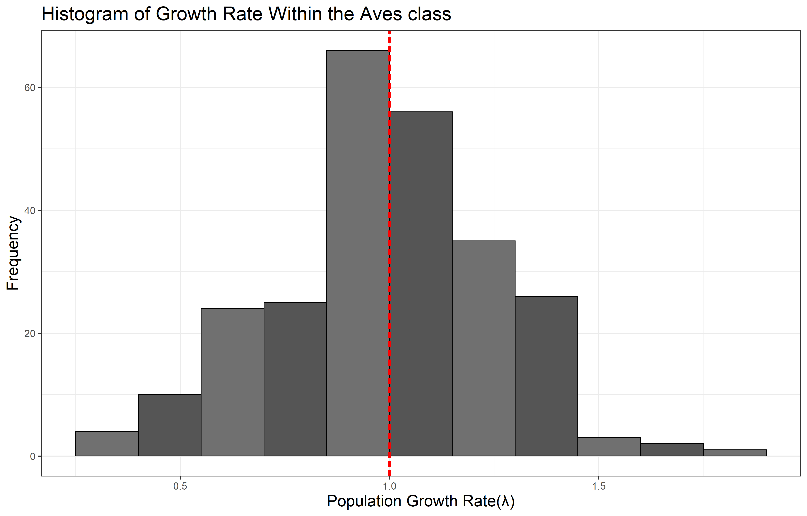
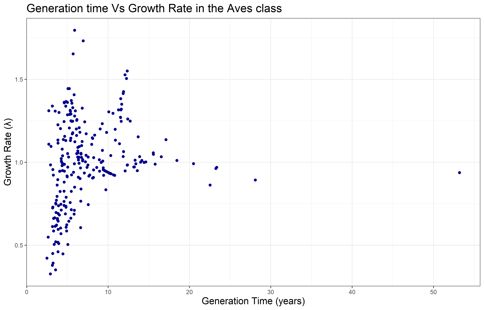
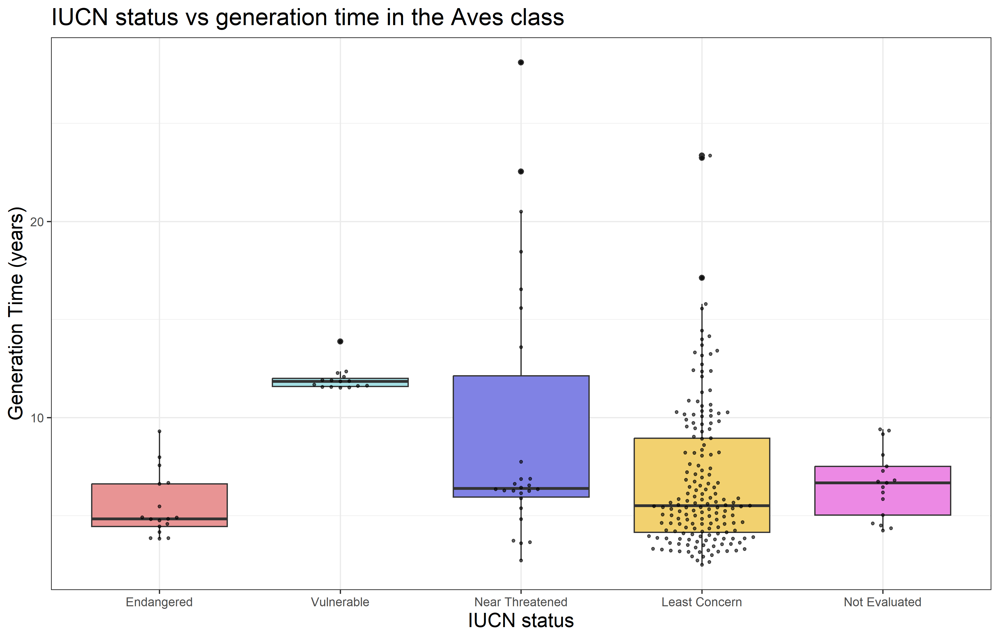
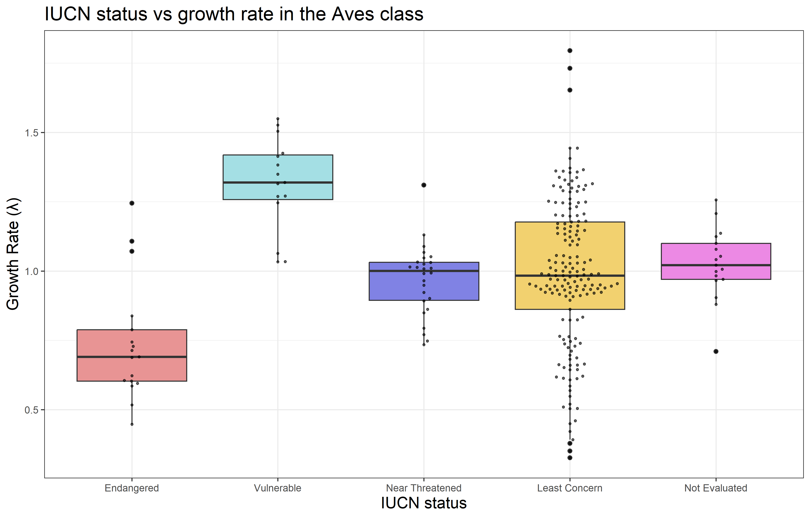
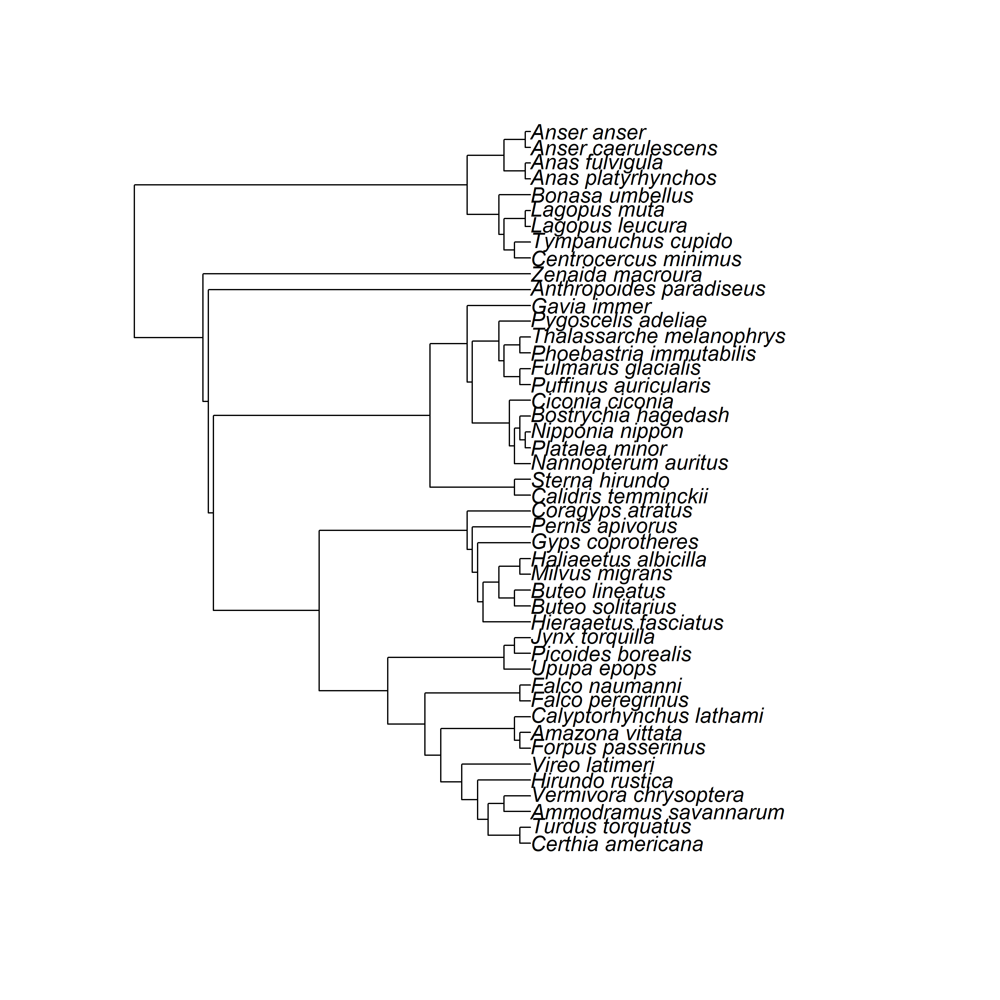
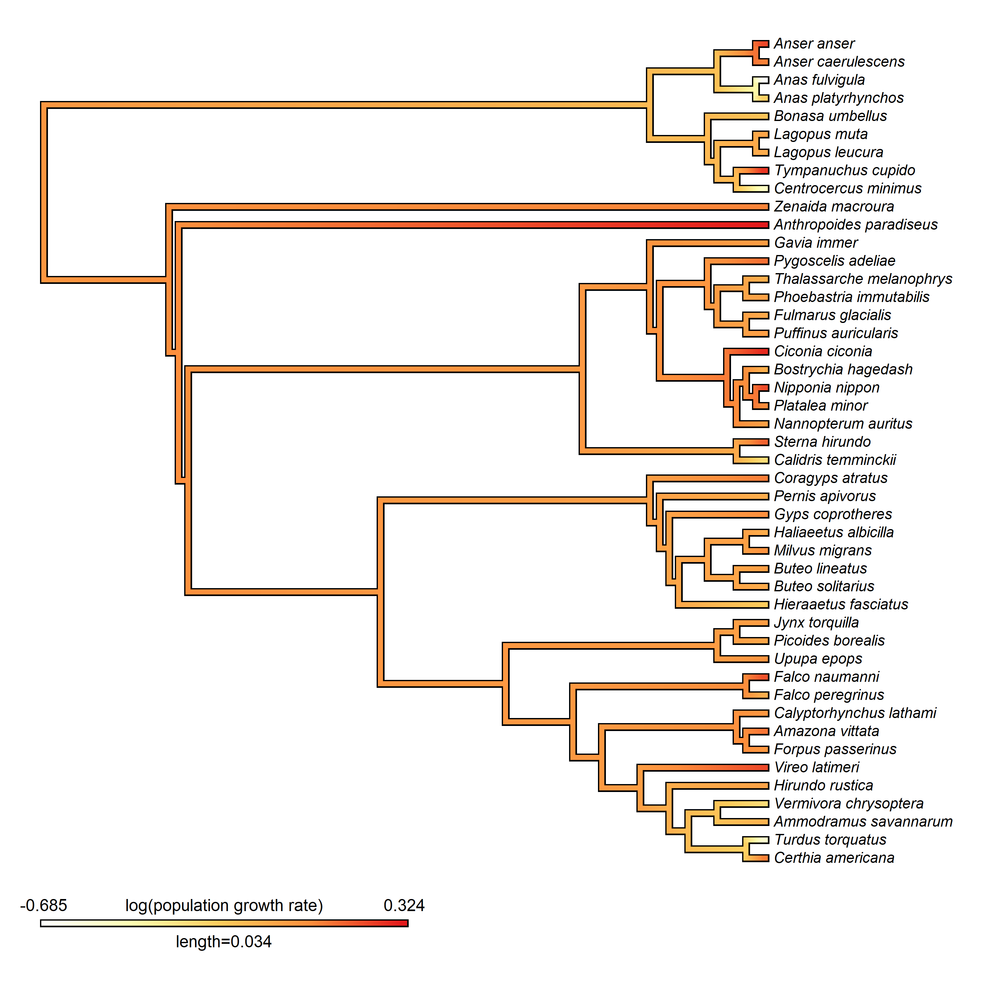
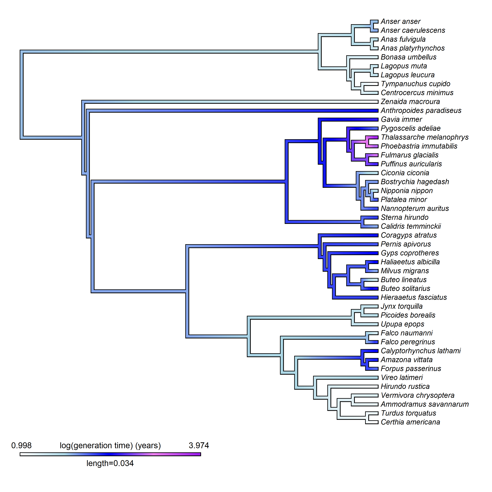
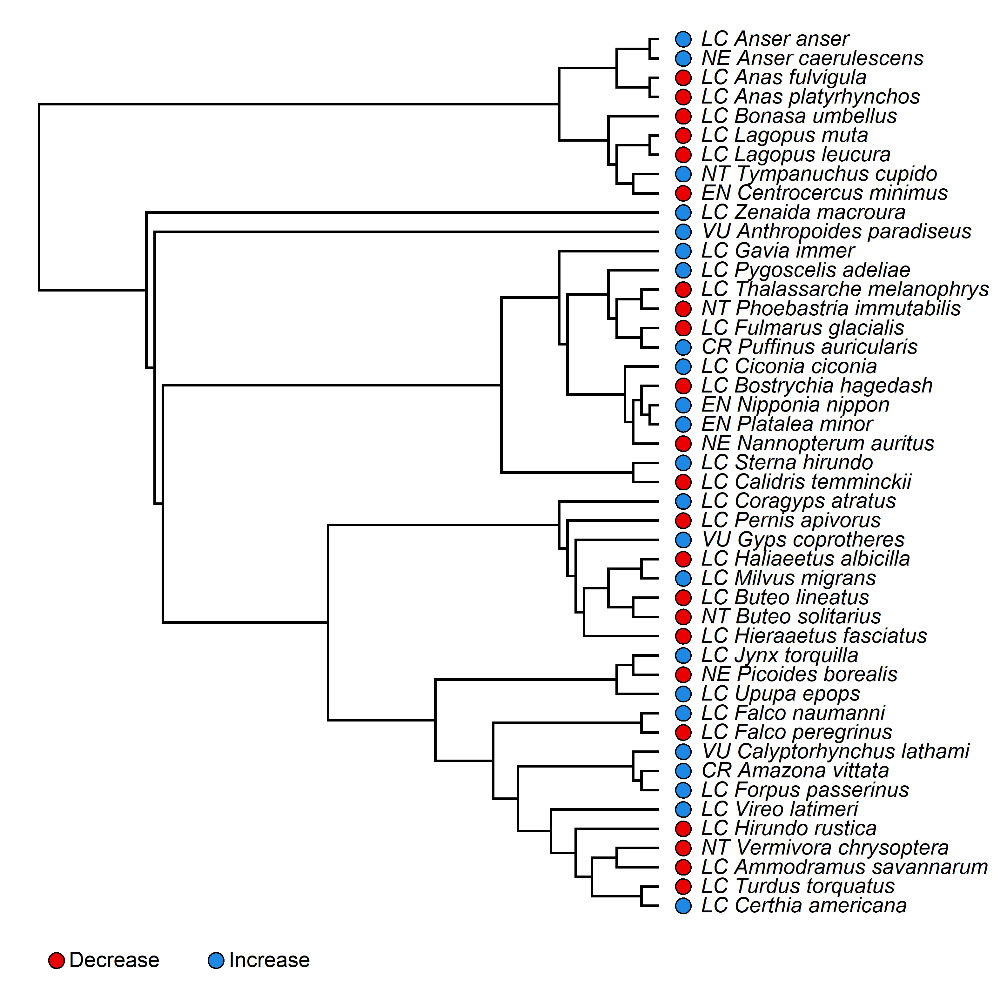

## Initialisation

```{r setup, include=FALSE}
knitr::opts_chunk$set(echo = TRUE, warning = FALSE, 
                      message = FALSE)
```

```{r loading of packages and functions}
# clearing the environment
rm(list = ls())

# loading packages
library(Rcompadre)
library(tidyverse)
library(here)
library(phytools)
library(taxize)
library(Rage)
library(popbio)
library(ggbeeswarm)
library(FSA)
library(dunn.test)

# loading self made functions (file contents shown at the end of document)
source(here("Data", "Functions.R"))
```

# Introduction

In this document we run an analysis of biological patterns within the Aves class using data from various online databases. We collect demographic data from comadre, species' status from IUCN RedList and phylogenetic data from the Open Tree of Life project. Focusing on their growth rate, generation time, status and the relationships of these variables to eachother, and to their phylogeny.

This Document also functions as a template for this analysis to be used for any species, by changing the variable "class" to the name of the class (as used in the comadre database) you want to follow, and the code will run the same analysis on that data and change figures and figure titles accordingly, and the rest of the code is created so you can easily change the values being analysed. Some extra work may be needed to account for inconsistencies between databases.

On the anonomised github repository you can find all of the files used and a blank template, "Large datasets template.rmd", containing the code without specific analysis and write up for usage in your own analysis [@the2025].

GitHub Link: <https://github.com/The-Nedstar/LargeDatasets>

## Enter your species of interest here:

```{r}
class <- "Aves"
```

------------------------------------------------------------------------

# Comadre

Comadre is a online database containing demographic data for many animals collected from almost a thousand studies hosted at the Max Planck institute [@salguero-gómez2016]. It includes: Their species identification and taxonomy; geographical data; population parameters such as generation time and growth rate and information on the studies the data is taken from. Population parameters are stored in matrix population models (MPMs) all accessible through R studio as well as various other programs. This database is particularly useful for ecologists, evolutionary biologists and conservationists.

## Acessing Data

```{r}
## creating class variable for titling of figures
ClassName <- paste(class, "class")

## fetching data from the comadre database
Comadre <- cdb_fetch("comadre")

## Subsetting data
# subsetting to wild, unmanipulated individuals from chosen class
ComSub <- subset(Comadre,
                   Class == class &
                   MatrixTreatment == "Unmanipulated" &
                   MatrixCaptivity == "W")
# flagging and subsetting to only data without NAs and which is ergodic
ComFlag <- cdb_flag(ComSub)
ComSubFlag <- subset(ComFlag,
                      check_NA_A == FALSE &
                      check_ergodic == TRUE)
```

## Distribution of growth rate and generation time (Q1)

We first Take a look at the distribution of both growth rate and generation time within our class using the data collected from comadre.

```{r Data wrangling for distribution analysis}
## extraction of growth rate and generation time from the MPMs
ComSubFlag$lambda <- unlist(lapply(matA(ComSubFlag), 
                                   popbio::lambda))
ComSubFlag$generation_time <- unlist(lapply(matA(ComSubFlag),
                                   popbio::generation.time))

## removing any observations with infinite or NA values in either variable
GTvL <- as_data_frame(ComSubFlag) %>%
  select(lambda, generation_time) %>% 
  mutate(across(everything(), ~ na_if(., Inf))) %>% 
  mutate(across(everything(), ~ na_if(., -Inf))) %>%
  drop_na()
```

```{r Histogram of growth rate distribution}
## using a self made function to save an svg of a histogram
histogram(GTvL, GTvL$lambda,
          "Population Growth Rate(λ)", 
          paste("Histogram of Growth Rate Within the",
                ClassName), 0.15, TRUE, "LHist.png")
```

------------------------------------------------------------------------



------------------------------------------------------------------------

```{r Summary Stats, echo=FALSE}
## Printing summary statistics for growth rate
cat("--- Summary statistics for Growth rate ---\n")
summary(GTvL$lambda)
```

It appears the population growth grate is roughly normally distributed around a mean of \~0.9944 so the majority of species are stable with a roughly even distribution between increasing and decreasing. With the mean being so close to 1, this means that on average the species are stable.

```{r Histogram of generation time distribution}
## using a self made function to save an svg of a histogram
histogram(GTvL, GTvL$generation_time,
          "Generation Time (years)", 
          paste("Histogram of Generation Time Within the",
                ClassName), 1, FALSE, "GTHist.png")

```

------------------------------------------------------------------------


------------------------------------------------------------------------

```{r printing values, echo=FALSE}
## Printing summary statistics for generation time
cat("--- Summary statistics for generation time ---\n")
summary(GTvL$generation_time)
```

The distribution fo generation time appears to be assymetrically distributed with a right skew with a mean of \~7.494 but a median of \~5.944. So most of the species are shorter living (\<10 years) with a fewer that surpass this.

## Relationship between Growth rate and generation time (Q2)

For the next part of the analysis, we compare growth rate and generation time to each other and attempt to fit a model to explore potential correlations. We would expect there to be a negative correlation between the variables.

H0: There is no significant relationship between growth rate and generation time

H1: There is a significant relationship between growth rate and generation time

```{r Scatterplot of growth rate compared to generation time}
## creation of a explorative scatterplot comparing growth rate and generation time using a self made function
scatterplot(GTvL, GTvL$generation_time, 
            "Generation Time (years)", 
            GTvL$lambda, "Growth Rate (λ)", 
            paste("Generation time Vs Growth Rate in the",
                  ClassName), FALSE, "GTvL.png")
```

------------------------------------------------------------------------



------------------------------------------------------------------------

From first inspection there is potentially a positive relationship, but it is unlikely to be linear. The heterogeneity between growth rate (mostly normal) and generation time (very skewed) is going to make the analysis quite difficult and using a transformation or a non-parametric alternative is likely going to be needed. Due to this, we will run multiple generalised linear models with different parameters.

### **Linear model**

```{r Running standard linear model}
## creation of a version of the dataset without the outlier
CGTvL <- subset(GTvL, generation_time < 50)

## creation of a linear model and testing violations of assumptions using a diagnostic plot
# with all the data
GTvLMod <- lm(lambda ~ generation_time, GTvL)
diagnostic_plots("GTvLMod DP.png", GTvLMod)
# with the outlier removed
CGTvLMod <- lm(lambda ~ generation_time, CGTvL)
diagnostic_plots("CGTvLMod DP.png", CGTvLMod)
```

**Log transformed**

```{r running log transformed linear model}
## creation of a log transformed linear model and testing violations of assumptions using a diagnostic plot
# with all data
LGTvLMod <- lm(log(lambda) ~ log(generation_time), GTvL)
diagnostic_plots("LGTvLMod DP.png", LGTvLMod)
# with the outlier removed
LCGTvLMod <- lm(log(lambda) ~ log(generation_time), CGTvL)
diagnostic_plots("LCGTvLMod DP.png", LCGTvLMod)
```

**Polynomial**

```{r running a polynomial model}
## creation of a polynomial model and testing violations of assumptions using a diagnostic plot
# with all the data
PGTvLMod <- lm(lambda ~ generation_time + I(generation_time^2) + I(generation_time^3), GTvL)
diagnostic_plots("PGTvLMod DP.png", PGTvLMod)
# with the outlier removed
PCGTvLMod <- lm(lambda ~ generation_time + I(generation_time^2) + I(generation_time^3), CGTvL)
diagnostic_plots("PCGTvLMod DP.png", PCGTvLMod)
```

------------------------------------------------------------------------


------------------------------------------------------------------------

It appears that the data violates the assumptions of a generalized linear model under all attempted variations. For all models, both with and without the outlier removed the 'residuals vs fitted' and 'scale vs location' plots both show deviations from a flat horizontal relationship, indicating that the data hetereoscedastic and the relationship is non-linear.\
The polynomial has the least violation of these assumptions, however the outliers have a greater impact on the data, even when the most severe outlier is removed.

### Spearman's rank correlation coefficient

Due to the data violating the assumptions of a linear model approach, we decided to move forward with a non parametric approach using a Spearman's rank correlation coefficient. Our data does match the assumptions as it is monotonic with independent observations and as a ranked method it is robust to outliers.

```{r Spearmans rank correlation test, echo=FALSE}
cat("--- Outcome of the Spearman's rank correlation test ---\n")
cor.test(GTvL$lambda, GTvL$generation_time, method = "spearman")
```

The results of this test show that there is sufficient data to reject our null hypotheses. There appears to be a relatively weak positive relationship between the data. Considering the diagnostic plots from earlier this relationship is likely non-linear.

------------------------------------------------------------------------

# IUCN RedList

The International Union for the Conservation of Nature (IUCN) is a collection of organisations that work together to aid in conservation efforts [@theiucn]. the RedList is a database containing many species and describing their conservation status. Using this database, research and conservation efforts can be effectively distributed between the species that most need it.

## Acessing data (Q3)

Due to issues with accessing the online database, instead we have imported the data relevant to the comadre database from a csv (also accessible on the github repository, under the folder "Data" [@the2025]).

```{r combining IUCN and comadre datasets}
## loading the IUCNRedList data
IUCNData <- read.csv(here("Data", "IUCN_comadre_compadre.csv"))
# combining with our comadre dataset
ComIUCN <- ComSubFlag %>%
  left_join(x = ., y = IUCNData, by = "SpeciesAccepted") %>% 
  mutate(IUCNstatus = replace_na(IUCNstatus, "NE"))
# producing a new column converting the two letter status codes into full words
ComIUCN <- ComIUCN %>% 
  mutate(IUCNstatLong = case_when(
    IUCNstatus == "EN" ~ "Endangered",
    IUCNstatus == "VU" ~ "Vulnerable",
    IUCNstatus == "NT" ~ "Near Threatened",
    IUCNstatus == "LC" ~ "Least Concern",
    IUCNstatus == "DD" ~ "Data Deficient",
    IUCNstatus == "CR" ~ "Critically Endangered",
    IUCNstatus == "EW" ~ "Extinct in the wild",
    IUCNstatus == "EX" ~ "Extinct",
    IUCNstatus == "NE" ~ "Not Evaluated"),
    IUCNstatLong = factor(IUCNstatLong, 
                        levels = c("Extinct in the wild",
                                   "Extinct","Endangered",
                                   "Vulnerable",
                                   "Near Threatened",
                                   "Least Concern",
                                   "Data Deficient",
                                   "Not Evaluated")))
## converting into a data frame
ComIUCN <- as_data_frame(ComIUCN)
```

## analysis

```{r Producing a dataframe with only the necessary values and NAs/ infinite values removed}
IUCNVGTvL <- subset(as_data_frame(ComIUCN),generation_time < 50) %>%
  select(lambda, generation_time, IUCNstatLong) %>% 
  mutate(across(c(lambda, generation_time), 
                ~ na_if(., Inf))) %>% 
  mutate(across(c(lambda, generation_time), 
                ~ na_if(., -Inf))) %>%
  drop_na()
```

**generation time**

```{r Comparing status to generation time}
## using a self made function to produce a boxplot comparing the varaibles
boxplot(IUCNVGTvL, IUCNVGTvL$IUCNstatLong, "IUCN status", IUCNVGTvL$generation_time, "Generation Time (years)", paste("IUCN status vs generation time in the", ClassName), "IUCNvGT.png")

## running an ANOVA analysis
cat("--- ANOVA analysis of differences in generation time between conservation statuses ---/n")
ANOVAGT <- aov(generation_time ~ IUCNstatLong, data = IUCNVGTvL)
summary(ANOVAGT)

cat("--- Dunn's test analysis of differences in generation time between conservation statuses ---/n")
dunnTest(generation_time ~ IUCNstatLong, data = IUCNVGTvL)
```

------------------------------------------------------------------------



------------------------------------------------------------------------

There is a significant difference between vulnerable and the rest of the categories, but none between the rest of the categories. This suggests that species with longer generations are more likely to be categorised as vulnerable. However, this relationship is not found with endangered species, making the overall effect of generation time on vulnerability unclear.

**Growth Rate**

```{r comparing status to population growth rate}
## using a self made function to produce a boxplot comparing the varaibles
boxplot(IUCNVGTvL, IUCNVGTvL$IUCNstatLong, "IUCN status", IUCNVGTvL$lambda, "Growth Rate (λ)", paste("IUCN status vs growth rate in the", ClassName), "IUCNvL.png" )

## running an ANOVA analysis
cat("--- ANOVA analysis of differences in growth rate between conservation statuses ---/n")
ANOVALambda <- aov(lambda ~ IUCNstatLong, data = IUCNVGTvL)
summary(ANOVALambda)

cat("--- Dunn's test analysis of differences in growth rate between conservation statuses ---/n")
dunnTest(lambda ~ IUCNstatLong, data = IUCNVGTvL)
```

------------------------------------------------------------------------



------------------------------------------------------------------------

In the case of population growth rate, Near threatened and least concerned show no significant different from each other, or from species which have not been evaluated. Endangered species show a significantly decreased growth rate, as expected, whereas vulnerable species show an increased growth rate. This is potentially due to implementation of succsessful protective strategies increasing the growth rate of species which have been described as vulnerable.

------------------------------------------------------------------------

# open tree of life (Q4)

The open tree of life is a collaborative effort to create a dynamic phylogeny of the entire tree of life. It is openly accessible through an API, but in this case it is being accessed through a .tre file of all of the data relevant to the comadre dataset from the repository [@jones2024] (also accessible on the github repository, under the folder "Data" [@the2025]).

```{r eliminating species that arent in the open tree of life}
## Creating a new dataframe with each species only present once
ComSingle <- ComIUCN[which(
  duplicated(ComIUCN$SpeciesAccepted) == FALSE),]

## wrangling data using the open tree of life online API
# Creating a list of names from our dataframe that matches an entry in the open tree of life
ResNames <- rotl::tnrs_match_names(names = ComSingle$SpeciesAccepted)
# adding the open tree of life id to our dataframe
ComSingle$ott_id <- ResNames$ott_id
# removing any values where there is no id
ComSingle <- ComSingle[-which(is.na(ComSingle$ott_id)),]
# updating our list of mached names using only the ones with an id
ResNames <- rotl::tnrs_match_names(names = ComSingle$SpeciesAccepted)
# putting this names into a new column in our dataframe
ComSingle$OTL_unique_name <- ResNames$unique_name
```

```{r Creating our phylogenetic tree}
## Loading in the tree data
Tree <- read.tree(here("Data", "COMPADRE-COMADRE_Phylo_June_16_2019.tre"))

## remove NA and infinite values from our dataframe          
ComSingle <- ComSingle  %>% 
  mutate(across(c(lambda, generation_time), ~ na_if(., Inf))) %>% 
  mutate(across(c(lambda, generation_time), ~ na_if(., -Inf))) %>%
  drop_na(lambda, generation_time)
                  
## Using the Open tree of life to create our own tree
# Shortening the tip labels
Tree$tip.label <- gsub("_", " ", Tree$tip.label)
# Removing species which aren't in our dataframe
PrunedTree <- drop.tip(Tree, setdiff(Tree$tip.label, ComSingle$OTL_unique_name))
# alterning the order of our dataframe to map the tree
ComSingle <- ComSingle[match(PrunedTree$tip.label,ComSingle$OTL_unique_name),]
# setting the species names as the row names
row.names(ComSingle) <- ComSingle$OTL_unique_name

## Plotting our Pruned tree
png(filename = here("Figures", "PrunedTree.png"), width = 20, height= 20, units = "cm", res = 400) 
plot(PrunedTree, fsize = c(0.7,0.8)) 
dev.off()
```

------------------------------------------------------------------------



------------------------------------------------------------------------

## Plotting phylogeny with population parameters

### **growth rate**

```{r}
## Creating a list containing the Log of the growth rate attached to the species name
LogL <- log(setNames(ComSingle$lambda, row.names(ComSingle)))

## creating a phylogenetic tree coloured based on the population growth rate
ContMapL <- contMap(PrunedTree, LogL,plot=FALSE,res=1000,
                    method="anc.ML") 
ContMapL <- setMap(ContMapL, c("white","#FFFFB2","#FECC5C",
                               "#FD8D3C","#E31A1C"))

## Plotting the phylogenetic tree
png(filename = here("Figures", "ContMapLambda.png"), width = 20, height= 20, units = "cm", res = 400) 
plot(ContMapL, fsize = c(0.7,0.8), leg.txt = 
       "log(population growth rate)") 
dev.off()

```

------------------------------------------------------------------------



------------------------------------------------------------------------

It doesn't appear that the population growth rate does is not affected by phylogenetic inertia. There is no clear clustering or relation between individuals with either particularly high or low growth rates, with growth rates often being very different from closely related individuals.

### **Generation time**

```{r}
## Creating a list containing the Log of the generation time attached to the species name
LogGT <- log(setNames(ComSingle$generation_time, row.names(ComSingle)))

## creating a phylogenetic tree coloured based on the generation time
ContMapGT <- contMap(PrunedTree, LogGT,plot=FALSE,res=200, 
                     method="anc.ML")
ContMapGT <- setMap(ContMapGT, c("white","light blue","blue",
                                 "violet","purple"))

## Plotting the phylogenetic tree
png(filename = here("Figures", "ContMapGT.png"), 
        width = 20, height= 20, units = "cm", res = 400)
plot(ContMapGT, fsize=c(0.7,0.8), leg.txt = 
       "log(generation time) (years)")
dev.off()
```

------------------------------------------------------------------------



------------------------------------------------------------------------

Generation time on the other hand shows a substantial effect of phylogenetic inertia. It is generally more closely matched between closely related individuals than those which are distantly related and shows strong clustering.

## population performance (Q5)

This final phylogeny shows Whether each species is increasing (population growth rate \> 1) or decreasing (population growth rate \<1) as well as their conservation status.

using code from [@exercise]

```{r}
## Creating a list of either "Increase" if growth rate is greater than one, or "Decrease" if it is less
PopPerf <- as_data_frame(ComSingle$lambda) %>% 
  mutate(category = factor(
    case_when(value < 1  ~ "Decrease",
              value > 1  ~ "Increase")))

## adding the conservation status to the tip labels
# seperating creating a new column in our dataframe combining the status and the species name into one string
ComSingle$TipName <- paste(ComSingle$IUCNstatus,
                           ComSingle$OTL_unique_name, 
                           sep = " ")
# replacing the tip labels with these new strings
PrunedTree$tip.label <- ComSingle$TipName
# replacing PopPerf with a list of factors as named by our new tip labels
PopPerf <- as.factor(setNames(PopPerf$category,
            ComSingle$TipName))

## plotting our new tree
png(filename = here("Figures", "PerfTree.png"), width = 20,
          height= 20,
          units = "cm", res = 400)
# plotting a tree with dots coloured depending on whether the growth rate is greater than or less than 1
dotTree(PrunedTree, PopPerf, colors = setNames(
                     c("#EA0000", "#1E88E5"),
                     c("Decrease","Increase")),
        ftype="i", )
dev.off()
```

------------------------------------------------------------------------



------------------------------------------------------------------------

------------------------------------------------------------------------

# Appendix

## references

::: {#refs}
:::

## Contents of the Functions.R file

Can also be found on the anonymised github repository [@the2025].

```{r echo=TRUE, eval=FALSE}
###########################################
# Functions for the Large Dataset assignment
# author: anonymous
###########################################

### creation of a histogram
histogram <- function(Data, Xaxis, Xtitle, Title, BW, Line, File){
  ## defining the histogram
  temp <- ggplot(Data, aes(x = Xaxis)) +
    geom_histogram(aes(fill = as.factor(floor(..x.. / BW) %% 2)), # alternative colours
                   binwidth = BW, boundary = 1, # ensuring it is split at the value 1
                   colour = "black", size = 0.4) +
    (if (Line == TRUE) { # only carrying out if specified
      geom_vline(xintercept = 1, colour = "red", 
                 size = 1.3, linetype = "21")}) + # creates a vertical line at the value 1
    scale_fill_manual(values = c("#707070", "#555555")) + # specifying alternating colours
    theme_bw()+
    theme(
      legend.position = "none", # removing the legend
      axis.title = element_text(size = 14),
      title = element_text(size = 14)
    ) +
    xlab(Xtitle) +
    ylab("Frequency") +
    ggtitle(Title)
  ## saving the graph as a .png
  png(filename = here("Figures", File), width = 25,
          height = 16,
          units = "cm", res = 400)
  print(temp)
  dev.off()
}

### create a scatterplot
scatterplot <- function(Data, Xaxis, Xtitle, Yaxis, Ytitle, Title, Line, File){
  ## creating the scatterplot
  temp <- ggplot(Data, aes(x = Xaxis, y = Yaxis)) +
    geom_point(colour = "darkblue")+
    (if (Line == TRUE) { # Only running if specified
      geom_smooth(method = "lm", se = TRUE, linetype = "solid", 
                  colour = "darkred")}) + # creating a line defined by a generalised linear model
    theme_bw()+
    theme(
      legend.position = "none", # removing the legend
      axis.title = element_text(size = 14),
      title = element_text(size = 14)
    ) +
    xlab(Xtitle) +
    ylab(Ytitle) +
    ggtitle(Title)
  ## saving as a .png
  png(filename = here("Figures", File), width = 25,
          height = 16,
          units = "cm", res = 400)
  print(temp)
  dev.off()
}

### Create Diagnostic plots
diagnostic_plots <- function(File, Model) {
  ## saving plot as an SVG
  png(filename = here("Figures", File), width = 25,
          height= 20,
          units = "cm", res = 400)
  ## creating a multi plot
  # defining multi plot layout
  par(mfrow=c(2,2))
  # combining each diagnostic plot into one multi plot
  DiaPlots <- (plot(Model,1) | plot(Model,2)) / (plot(Model,3) | plot(Model,5))
  dev.off()
}

### create a boxplot
boxplot <- function(Data, Xaxis, Xtitle, Yaxis, Ytitle, Title, File){
  ## defining the boxplot
  temp <- ggplot(Data, aes(x = Xaxis, y = Yaxis, fill = Xaxis)) +
    geom_boxplot() +
    geom_beeswarm(alpha = 0.6, size = 0.75, corral.width = 0.5) +
    scale_fill_manual(values = c("#E89494", "#A4DFE4", "#8082E4",
                                 "#F2D16F", "#EC89E4")) + # defining colours
    theme_bw() +
    theme(
      legend.position = "none", # removing the legend
      axis.title = element_text(size = 14),
      title = element_text(size = 14)
    ) +
    xlab(Xtitle) +
    ylab(Ytitle) +
    ggtitle(Title)
  ## saving as a .png
  png(filename = here("Figures", File), width = 25,
          height = 16,
          units = "cm", res = 400)
  print(temp)
  dev.off()
}
```
