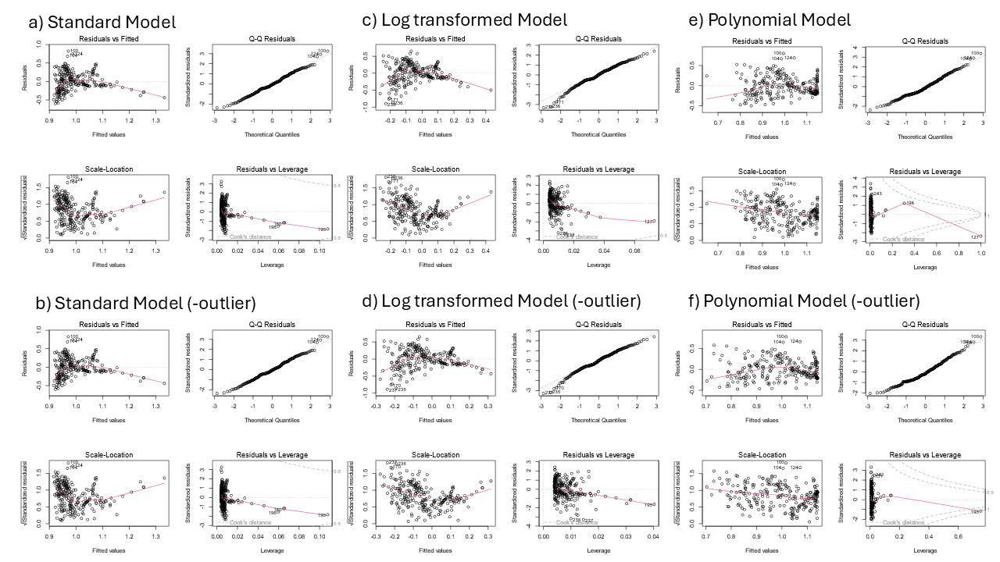
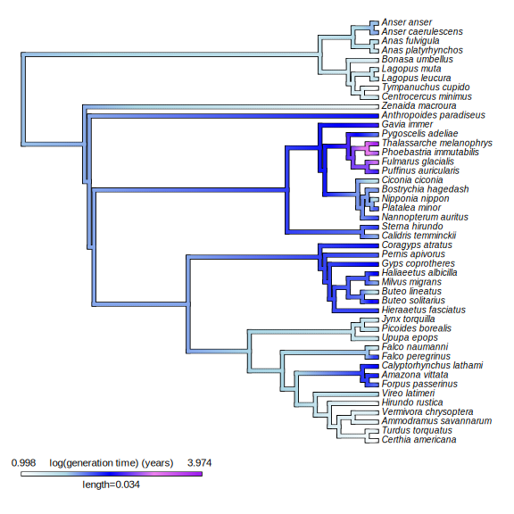
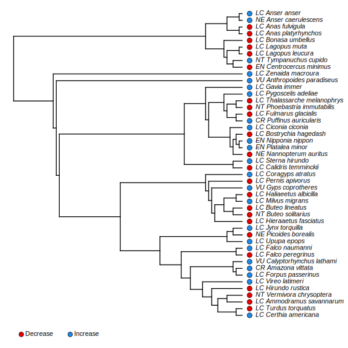

## Initialisation

```{r setup, include=FALSE}
knitr::opts_chunk$set(echo = TRUE, warning = FALSE)
```

```{r}
rm(list = ls())
library(Rcompadre)
library(tidyverse)
library(here)
library(phytools)
library(taxize)
library(Rage)
library(popbio)
library(svglite)
library(ggbeeswarm)
source(here("Functions.R"))
```

# introduction

# Compadre

## Acessing Data

```{r}
class <- "Aves"
ClassName <- paste(class, "class")
Comadre <- cdb_fetch("comadre")
ComSub <- subset(Comadre,
                   Class == class & #
                   MatrixTreatment == "Unmanipulated" &
                   MatrixCaptivity == "W")
ComFlag <- cdb_flag(ComSub)
ComSubFlag <- subset(ComFlag,
                      check_NA_A == FALSE &
                      check_ergodic == TRUE)
```

## Data

### Histograms

```{r echo=TRUE, message=FALSE, warning=FALSE}
ComSubFlag$lambda <- unlist(lapply(matA(ComSubFlag), 
                                   popbio::lambda))

ComSubFlag$generation_time <- unlist(lapply(matA(ComSubFlag), 
                                   popbio::generation.time))
GTvL <- as_data_frame(ComSubFlag) %>%
  select(lambda, generation_time) %>% 
  mutate(across(everything(), ~ na_if(., Inf))) %>% 
  mutate(across(everything(), ~ na_if(., -Inf))) %>%
  drop_na()

#Examine the distribution of population growth rates:
histogram(GTvL, GTvL$lambda,
          "Population Growth Rate(λ)", 
          paste("Histogram of Growth Rate Within the ", ClassName), 0.2, TRUE, 
          "LHist.svg")

histogram(GTvL, GTvL$generation_time,
          "Generation Time (years)", 
          paste("Histogram of Generation Time Within the ", ClassName), 1, FALSE, 
          "GTHist.svg")
```


## relationship

```{r echo=TRUE, message=FALSE, warning=FALSE}
scatterplot(GTvL, GTvL$generation_time, 
            "Generation Time (years)", 
            GTvL$lambda, "Growth Rate (λ)", 
            paste("Generation time Vs Growth Rate in the ", ClassName), FALSE, "GTvL.svg")
```


### Linear model

normal

```{r}
CGTvL <- subset(GTvL, generation_time < 50)

GTvLMod <- lm(lambda ~ generation_time, GTvL)
diagnostic_plots("GTvLMod DP.svg", GTvLMod)

CGTvLMod <- lm(lambda ~ generation_time, CGTvL)
diagnostic_plots("CGTvLMod DP.svg", CGTvLMod)
```

log transformed

```{r}
LGTvLMod <- lm(log(lambda) ~ log(generation_time), GTvL)
diagnostic_plots("LGTvLMod DP.svg", LGTvLMod)

LCGTvLMod <- lm(log(lambda) ~ log(generation_time), CGTvL)
diagnostic_plots("LCGTvLMod DP.svg", LCGTvLMod)
```

polynomial

```{r}
PGTvLMod <- lm(lambda ~ generation_time + I(generation_time^2) + I(generation_time^3), GTvL)
diagnostic_plots("PGTvLMod DP.svg", PGTvLMod)

PCGTvLMod <- lm(lambda ~ generation_time + I(generation_time^2) + I(generation_time^3), CGTvL)
diagnostic_plots("PCGTvLMod DP.svg", PCGTvLMod)
```



## Spearman's rank correlation coefficient

-   other things very much not working

-   so trying a non parametric method

-   meets the assumptions

    -   monotonic

    -   outlier doesn't matter as robust

    -   indepedent observations

```{r}
cor.test(GTvL$lambda, GTvL$generation_time, method = "spearman")
```

-   very significant

-   moderate positive correlation, but doesn't describe the data too well

### Plotting

```{r}
scatterplot(GTvL, GTvL$generation_time,
            "Generation Time (years)", 
            GTvL$lambda, "Growth Rate (λ)", 
            paste("Generation time Vs Growth Rate in the", ClassName), TRUE, "GtvLc.svg")
```


## seperating duplicates?

```{r}
ComSingle <- ComSubFlag[which(
  duplicated(ComSubFlag$SpeciesAccepted)==FALSE),]
```

# IUCN RedList

## Acessing data

-   due to issues with data having to load from computer

```{r}
IUCNData<- read.csv(here("IUCN_comadre_compadre.csv"))

ComIUCN <- ComSubFlag %>%
  left_join(x = ., y = IUCNData, by = "SpeciesAccepted") %>% 
  mutate(IUCNstatus = case_when(
    IUCNstatus == "EN" ~ "Endangered",
    IUCNstatus == "VU" ~ "Vulnerable",
    IUCNstatus == "NT" ~ "Near Threatened",
    IUCNstatus == "LC" ~ "Least Concern",
    is.na(IUCNstatus) == TRUE ~ "Not Assessed"),
    IUCNstatus = factor(IUCNstatus, 
                        levels = c("Endangered","Vulnerable",
                                   "Near Threatened","Least Concern",
                                   "Not Assessed")))

ComIUCN <- as_data_frame(ComIUCN)

ComIUCN$IUCNcolour <- NA
ComIUCN$IUCNcolour[which(ComIUCN$IUCNstatus == "Endangered")] <- "Orange" 
ComIUCN$IUCNcolour[which(ComIUCN$IUCNstatus == "Vulnerable")] <- "Yellow"
ComIUCN$IUCNcolour[which(ComIUCN$IUCNstatus == "Near Threatened")] <- "Dark green"
ComIUCN$IUCNcolour[which(ComIUCN$IUCNstatus == "Least Concern")] <- "Green"
ComIUCN$IUCNcolour[which(ComIUCN$IUCNstatus == "Not Assessed")] <- "Blue"
```

## analysis

```{r}
IUCNVGTvL<- as_data_frame(ComIUCN) %>%
  select(lambda, generation_time, IUCNstatus) %>% 
  mutate(across(c(lambda, generation_time), ~ na_if(., Inf))) %>% 
  mutate(across(c(lambda, generation_time), ~ na_if(., -Inf))) %>%
  drop_na()
```

generation time

```{r}

boxplot(IUCNVGTvL, IUCNVGTvL$IUCNstatus, "IUCN status", IUCNVGTvL$generation_time, "Generation Time (years)", paste("IUCN status vs generation time in the", ClassName), "IUCNvGT.svg")


ANOVAGT <- aov(generation_time ~ IUCNstatus, data = IUCNVGTvL)
summary(ANOVAGT)
```


Growth Rate

```{r}
boxplot(IUCNVGTvL, IUCNVGTvL$IUCNstatus, "IUCN status", IUCNVGTvL$lambda, "Growth Rate (λ)", paste("IUCN status vs growth rate in the", ClassName), "IUCNvL.svg" )

ANOVALambda <- aov(lambda ~ IUCNstatus, data = IUCNVGTvL)
summary(ANOVALambda)
```


# open tree of life

```{r echo=TRUE, message=FALSE, warning=FALSE}
ComSingle <- ComIUCN[which(
  duplicated(ComIUCN$SpeciesAccepted)==FALSE),]

ResNames <- rotl::tnrs_match_names(names = ComSingle$SpeciesAccepted)

ComSingle$ott_id <- ResNames$ott_id
ComSingle <- ComSingle[-which(is.na(ComSingle$ott_id)),]

ResNames <- rotl::tnrs_match_names(names = ComSingle$SpeciesAccepted)

ComSingle$OTL_unique_name <- ResNames$unique_name

ComSingle <- as_data_frame(ComSingle)
row.names(ComSingle) <- ResNames$unique_name
```

```{r}

#This tree contains information for most of the species in COMADRE and COMPADRE, and can also be found here https://github.com/jonesor/compadreDB/tree/master/ under the subfolder "Phylogeny" 

Tree <- read.tree("COMPADRE-COMADRE_Phylo_June_16_2019.tre")

#Let's clean up the names in the tree, so we can compare them with the names in our object
Tree$tip.label <- gsub("_", " ", Tree$tip.label)

ComSingle <- ComSingle  %>% 
  mutate(across(c(lambda, generation_time), ~ na_if(., Inf))) %>% 
  mutate(across(c(lambda, generation_time), ~ na_if(., -Inf))) %>%
  drop_na(lambda, generation_time)

#Now we need to "prune" the tree, which means to cut out the branches that are not present in our data:
PrunedTree <- drop.tip(Tree, setdiff(Tree$tip.label, ComSingle$OTL_unique_name))

#The resulting tree has 34 tips, meaning 34 speci

#So naturally it seems like we are missing some from our object, which are not present in the tree.

ComSingle <- ComSingle[match(PrunedTree$tip.label,ComSingle$OTL_unique_name),]
row.names(ComSingle) <- ComSingle$OTL_unique_name
#Checking that the order is the same between the object and the tree

# Let us now plot the values of population growth rate at the tips of the phylogeny, and reconstruct the ancestral state of the originating lineange
LogL <- log(setNames(ComSingle$lambda, row.names(ComSingle)))
# create "contMap" object, which allows for the reconstruction of likely ancestral traits

```

growth rate

```{r}
ContMapL <- contMap(PrunedTree, LogL,plot=FALSE,res=1000, 
                    method="anc.ML") 
ContMapL <- setMap(ContMapL, c("white","#FFFFB2","#FECC5C",
                               "#FD8D3C","#E31A1C"))

svglite(here("Figures", "ContMapLambda.svg"), width = 8, height = 8, scaling = 1.2) 
plot(ContMapL, fsize = c(0.7,0.8), leg.txt = 
       "log(population growth rate)") 
par(mar=c(5.1,4.1,4.1,2.1))
## reset margins to default 
dev.off()

```


Generation time

```{r}
LogGT <- log(setNames(ComSingle$generation_time, row.names(ComSingle)))

ContMapGT <- contMap(PrunedTree, LogGT,plot=FALSE,res=200, 
                     method="anc.ML")
ContMapGT <- setMap(ContMapGT, c("white","light blue","blue",
                                 "violet","purple"))

svglite(here("Figures", "ContMapGT.svg"), 
        width = 8, height = 8, scaling = 1.2)
plot(ContMapGT, fsize=c(0.7,0.8), leg.txt = 
       "log(generation time) (years)")
dev.off()
```



## population performance

using code from [@exercise]

```{r}
## creating new column
PopPerf <- 
  as_data_frame(ComSingle$lambda) %>% 
  mutate(category = factor(
    case_when(value < 1  ~ "Decrease",
              value > 1  ~ "Increase")
  ))

IUCNstatus <- as_data_frame(ComSingle$IUCNstatus) %>% 
  mutate(IUCNstatus = case_when(
    value == "Endangered" ~ " EN",
    value == "Vulnerable" ~ " VU",
    value == "Near Threatened" ~ " NT",
    value == "Least Concern" ~ " LC",
    value == "Not Assessed" ~ " NA"))

IUCNstatus$name <- PrunedTree$tip.label

IUCNstatus$Name <- PrunedTree$tip.label

IUCNstatus$TipName <- paste(IUCNstatus$IUCNstatus, IUCNstatus$Name, 
                            sep = "   ")

row.names(PopPerf) <- IUCNstatus$TipName
PopPerf <- as.factor(setNames(PopPerf$category,
            IUCNstatus$TipName))

PrunedTree$tip.label <- IUCNstatus$TipName

svglite(here("Figures", "PerfTree.svg"), width = 8,
          height = 8,
          scaling = 1.1)
dotTree(PrunedTree, PopPerf, 
                   colors = setNames(
                     c("#EA0000", "#1E88E5"),
                     c("Decrease","Increase"))
                   , ftype="i", )
dev.off()
```


