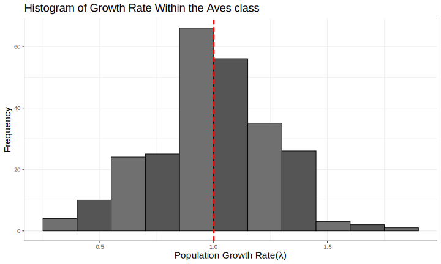

## Initialisation

```{r setup, include=FALSE}
knitr::opts_chunk$set(echo = TRUE, warning = FALSE, message = FALSE)
```

```{r}
# clearing the environment
rm(list = ls())

# loading packages
library(Rcompadre)
library(tidyverse)
library(here)
library(phytools)
library(taxize)
library(Rage)
library(popbio)
library(svglite)
library(ggbeeswarm)

# loading self made functions
source(here("Functions.R"))
```

# Abstract

In this document we run an analysis of biological patterns within the Aves class using data from various online subsets. We collect demographic data from Compadre, species' status from IUCN RedList and phylogenetic data from the Open Tree of Life project. Focusing on their growth rate, generation time, status and the relationships of these variables to eachother, and to their phylogeny.

From this data...

This Document also functions as a template for this analysis in any species, by changing the variable "class" to the name of the class (as used in the compadre database) you want to follow, and the code will run the same analysis on that data and change figures and figure titles accordingly, and the rest of the code is created so you can easily change the values being analysed. On [@the] anonomised github repository you can find all of the files used and a blank template, "Large datasets template.rmd", containing the code without specific analysis and write up of the Aves class for usage in your own analysis.

## Enter your species of interest here:

```{r}
class <- "Aves"
```

# Compadre

Compadre is a online database containing demographic data for many animals collected from almost a thousand studies hosted at the Max Planck institute. It includes: Their species identification and taxonomy; geographical data; population parameters such as generation time and growth rate and information on the studies the data is taken from. Population parameters are stored in matrix population models (MPMs) all accessible through R studio as well as various other programs. This database is particularly useful for ecologists, evolutionary biologists and conservationists

## Acessing Data

```{r}
## creating class variable for titling of figures
ClassName <- paste(class, "class")

## fetching data from the compadre database
Comadre <- cdb_fetch("comadre")

## Subsetting data
# subsetting to wild, unmanipulated individuals from chosen class
ComSub <- subset(Comadre,
                   Class == class &
                   MatrixTreatment == "Unmanipulated" &
                   MatrixCaptivity == "W")
# flagging and subsetting to only data without NAs and which is ergodic
ComFlag <- cdb_flag(ComSub)
ComSubFlag <- subset(ComFlag,
                      check_NA_A == FALSE &
                      check_ergodic == TRUE)
```

## Distribution of growth rate and generation time (Q1)

We first Take a look at the distribution of both growth rate and generation time within our clade using the data collected from Compadre

```{r Data wrangling for distribution analysis}
## extraction of growth rate and generation time from the MPMs
ComSubFlag$lambda <- unlist(lapply(matA(ComSubFlag), 
                                   popbio::lambda))
ComSubFlag$generation_time <- unlist(lapply(matA(ComSubFlag),
                                   popbio::generation.time))

## removing any observations with infinite or NA values in either variable
GTvL <- as_data_frame(ComSubFlag) %>%
  select(lambda, generation_time) %>% 
  mutate(across(everything(), ~ na_if(., Inf))) %>% 
  mutate(across(everything(), ~ na_if(., -Inf))) %>%
  drop_na()
```

```{r Histogram of growth rate distribution}
## using a self made function to save an svg of a histogram
histogram(GTvL, GTvL$lambda,
          "Population Growth Rate(λ)", 
          paste("Histogram of Growth Rate Within the",
                ClassName), 0.15, TRUE, "LHist.svg")
## Printing summary statistics for growth rate
cat("--- Summary statistics for Growth rate ---\n")
summary(GTvL$lambda)
```



It appears the populationg growth grate is roughly normally distributed around a mean of \~0.9944.

```{r Histogram of generation time distribution}
## using a self made function to save an svg of a histogram
histogram(GTvL, GTvL$generation_time,
          "Generation Time (years)", 
          paste("Histogram of Generation Time Within the",
                ClassName), 1, FALSE, "GTHist.svg")
## Printing summary statistics for generation time
cat("--- Summary statistics for generation time ---\n")
summary(GTvL$generation_time)
```


The distribution fo generation time appears to be assymetrically distributed with a right skew.

## Relationship between Growth rate and generation time (Q2)

For the next part of the analysis, we compare growth rate and generation time to eachother and attempt to fit a model to explore potential correlations. We would expect there to be a negative correlation between the variables.

H0: There is no significant relationship between growth rate and generation time

H1: There is a significant relationship between growth rate and generation time

```{r Scatterplot of growth rate compared to generation time}
## creation of a explorative scatterplot comparing growth rate and generation time using a self made function
scatterplot(GTvL, GTvL$generation_time, 
            "Generation Time (years)", 
            GTvL$lambda, "Growth Rate (λ)", 
            paste("Generation time Vs Growth Rate in the",
                  ClassName), FALSE, "GTvL.svg")
```


From first inspection there is potentially a positive relationship, but it is unlikely to be very substantial.

### **Linear model**

```{r Running standard linear model}
## creation of a version of the dataset without the outlier
CGTvL <- subset(GTvL, generation_time < 50)

## creation of a linear model and testing violations of assumptions using a diagnostic plot
# with all the data
GTvLMod <- lm(lambda ~ generation_time, GTvL)
diagnostic_plots("GTvLMod DP.svg", GTvLMod)
# with the outlier removed
CGTvLMod <- lm(lambda ~ generation_time, CGTvL)
diagnostic_plots("CGTvLMod DP.svg", CGTvLMod)
```

**Log transformed**

```{r running log transformed linear model}
## creation of a log transformed linear model and testing violations of assumptions using a diagnostic plot
# with all data
LGTvLMod <- lm(log(lambda) ~ log(generation_time), GTvL)
diagnostic_plots("LGTvLMod DP.svg", LGTvLMod)
# with the outlier removed
LCGTvLMod <- lm(log(lambda) ~ log(generation_time), CGTvL)
diagnostic_plots("LCGTvLMod DP.svg", LCGTvLMod)
```

**Polynomial**

```{r running a polynomial model}
## creation of a polynomial model and testing violations of assumptions using a diagnostic plot
# with all the data
PGTvLMod <- lm(lambda ~ generation_time + I(generation_time^2) + I(generation_time^3), GTvL)
diagnostic_plots("PGTvLMod DP.svg", PGTvLMod)
# with the outlier removed
PCGTvLMod <- lm(lambda ~ generation_time + I(generation_time^2) + I(generation_time^3), CGTvL)
diagnostic_plots("PCGTvLMod DP.svg", PCGTvLMod)
```


It appears that the data violates the assumptions of a generalized linear model under all attempted variations. For the all models, both with and without the outlier removed the residuals vs fitted and scale vs location plots both show deviations from a flat horizontal relationship, indicating that the data hetereoscedastic.\
The polynomial has the least violation of these assumptions, however the outliers have a greater impact on the data, even when the most severe outlier is removed.

### Spearman's rank correlation coefficient

Due to the data violating the assumptions of a linear model approach, we decided to move forward with a non parametric approach using a Spearman's rank correlation coefficient. Our data does match the assuptions as it is monotonic with independent observations and as a ranked method it is robust to outliers.

```{r Spearmans rank correlation test}
cat("--- Outcome of the Spearman's rank correlation test ---\n")
cor.test(GTvL$lambda, GTvL$generation_time, method = "spearman")
```

The results of this test show that there is sufficient data to suggest that there is enough data to reject our null hypotheses. There appears to be a relatively weak positive relationship between the data. Considering the

### **Plotting**

```{r}
scatterplot(GTvL, GTvL$generation_time,
            "Generation Time (years)", 
            GTvL$lambda, "Growth Rate (λ)", 
            paste("Generation time Vs Growth Rate in the",
                  ClassName), FALSE, "GtvLc.svg")
```


# IUCN RedList

The International Union for the Conservation of Nature (IUCN) is a collection of organisations that work together to aid in conservation efforts. the RedList is a list of many species categorizing their conservation status depending on their

-   international union for conservation of nature

    -   big collective of organisations

    -   all about helping people to help conserve

-   classifies the status of them in terms of their conservation

-   helps them to be treated accordingly

## Acessing data (Q3)

-   due to issues with data having to load from computer

```{r}
IUCNData<- read.csv(here("IUCN_comadre_compadre.csv"))

ComIUCN <- ComSubFlag %>%
  left_join(x = ., y = IUCNData, by = "SpeciesAccepted") %>% 
  mutate(IUCNstatus = case_when(
    IUCNstatus == "EN" ~ "Endangered",
    IUCNstatus == "VU" ~ "Vulnerable",
    IUCNstatus == "NT" ~ "Near Threatened",
    IUCNstatus == "LC" ~ "Least Concern",
    is.na(IUCNstatus) == TRUE ~ "Not Assessed"),
    IUCNstatus = factor(IUCNstatus, 
                        levels = c("Endangered","Vulnerable",
                                   "Near Threatened",
                                   "Least Concern",
                                   "Not Assessed")))

ComIUCN <- as_data_frame(ComIUCN)
```

## analysis

```{r}
IUCNVGTvL<- as_data_frame(ComIUCN) %>%
  select(lambda, generation_time, IUCNstatus) %>% 
  mutate(across(c(lambda, generation_time), ~ na_if(., Inf))) %>% 
  mutate(across(c(lambda, generation_time), ~ na_if(., -Inf))) %>%
  drop_na()
```

generation time

```{r}
boxplot(IUCNVGTvL, IUCNVGTvL$IUCNstatus, "IUCN status", IUCNVGTvL$generation_time, "Generation Time (years)", paste("IUCN status vs generation time in the", ClassName), "IUCNvGT.svg")


ANOVAGT <- aov(generation_time ~ IUCNstatus, data = IUCNVGTvL)
summary(ANOVAGT)
```


Growth Rate

```{r}
boxplot(IUCNVGTvL, IUCNVGTvL$IUCNstatus, "IUCN status", IUCNVGTvL$lambda, "Growth Rate (λ)", paste("IUCN status vs growth rate in the", ClassName), "IUCNvL.svg" )

ANOVALambda <- aov(lambda ~ IUCNstatus, data = IUCNVGTvL)
summary(ANOVALambda)
```


# open tree of life (Q4)

-   collaborative project to create a dynamic phylogeny

    -   comprehensive tree of life

    -   everything

    -   openly accessible

    -   single one

-   accessible through api interface

-   

```{r echo=TRUE, message=FALSE, warning=FALSE}
ComSingle <- ComIUCN[which(
  duplicated(ComIUCN$SpeciesAccepted)==FALSE),]

ResNames <- rotl::tnrs_match_names(names = ComSingle$SpeciesAccepted)

ComSingle$ott_id <- ResNames$ott_id
ComSingle <- ComSingle[-which(is.na(ComSingle$ott_id)),]

ResNames <- rotl::tnrs_match_names(names = ComSingle$SpeciesAccepted)

ComSingle$OTL_unique_name <- ResNames$unique_name

ComSingle <- as_data_frame(ComSingle)
row.names(ComSingle) <- ResNames$unique_name
```

```{r}

#This tree contains information for most of the species in COMADRE and COMPADRE, and can also be found here https://github.com/jonesor/compadreDB/tree/master/ under the subfolder "Phylogeny" 

Tree <- read.tree("COMPADRE-COMADRE_Phylo_June_16_2019.tre")

#Let's clean up the names in the tree, so we can compare them with the names in our object
Tree$tip.label <- gsub("_", " ", Tree$tip.label)

ComSingle <- ComSingle  %>% 
  mutate(across(c(lambda, generation_time), ~ na_if(., Inf))) %>% 
  mutate(across(c(lambda, generation_time), ~ na_if(., -Inf))) %>%
  drop_na(lambda, generation_time)

#Now we need to "prune" the tree, which means to cut out the branches that are not present in our data:
PrunedTree <- drop.tip(Tree, setdiff(Tree$tip.label, ComSingle$OTL_unique_name))

#The resulting tree has 34 tips, meaning 34 speci

#So naturally it seems like we are missing some from our object, which are not present in the tree.

ComSingle <- ComSingle[match(PrunedTree$tip.label,ComSingle$OTL_unique_name),]
row.names(ComSingle) <- ComSingle$OTL_unique_name
#Checking that the order is the same between the object and the tree

# Let us now plot the values of population growth rate at the tips of the phylogeny, and reconstruct the ancestral state of the originating lineange
LogL <- log(setNames(ComSingle$lambda, row.names(ComSingle)))
# create "contMap" object, which allows for the reconstruction of likely ancestral traits

```

growth rate

```{r}
ContMapL <- contMap(PrunedTree, LogL,plot=FALSE,res=1000, 
                    method="anc.ML") 
ContMapL <- setMap(ContMapL, c("white","#FFFFB2","#FECC5C",
                               "#FD8D3C","#E31A1C"))

svglite(here("Figures", "ContMapLambda.svg"), width = 8, height = 8, scaling = 1.2) 
plot(ContMapL, fsize = c(0.7,0.8), leg.txt = 
       "log(population growth rate)") 
par(mar=c(5.1,4.1,4.1,2.1))
## reset margins to default 
dev.off()

```


Generation time

```{r}
LogGT <- log(setNames(ComSingle$generation_time, row.names(ComSingle)))

ContMapGT <- contMap(PrunedTree, LogGT,plot=FALSE,res=200, 
                     method="anc.ML")
ContMapGT <- setMap(ContMapGT, c("white","light blue","blue",
                                 "violet","purple"))

svglite(here("Figures", "ContMapGT.svg"), 
        width = 8, height = 8, scaling = 1.2)
plot(ContMapGT, fsize=c(0.7,0.8), leg.txt = 
       "log(generation time) (years)")
dev.off()
```


## population performance (Q5)

using code from [@exercise]

```{r}
## creating new column
PopPerf <- 
  as_data_frame(ComSingle$lambda) %>% 
  mutate(category = factor(
    case_when(value < 1  ~ "Decrease",
              value > 1  ~ "Increase")
  ))

IUCNstatus <- as_data_frame(ComSingle$IUCNstatus) %>% 
  mutate(IUCNstatus = case_when(
    value == "Endangered" ~ " EN",
    value == "Vulnerable" ~ " VU",
    value == "Near Threatened" ~ " NT",
    value == "Least Concern" ~ " LC",
    value == "Not Assessed" ~ " NA"))

IUCNstatus$name <- PrunedTree$tip.label

IUCNstatus$Name <- PrunedTree$tip.label

IUCNstatus$TipName <- paste(IUCNstatus$IUCNstatus, IUCNstatus$Name, 
                            sep = "   ")

row.names(PopPerf) <- IUCNstatus$TipName
PopPerf <- as.factor(setNames(PopPerf$category,
            IUCNstatus$TipName))

PrunedTree$tip.label <- IUCNstatus$TipName

svglite(here("Figures", "PerfTree.svg"), width = 8,
          height = 8,
          scaling = 1.1)
dotTree(PrunedTree, PopPerf, 
                   colors = setNames(
                     c("#EA0000", "#1E88E5"),
                     c("Decrease","Increase"))
                   , ftype="i", )
dev.off()
```


